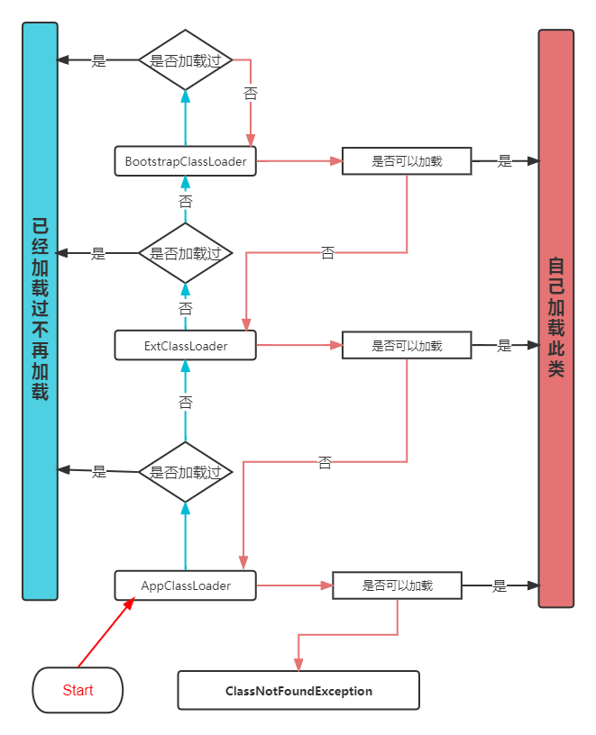

# JVM

## 类加载机制

### 类加载器

#### ClassLoader

- **Bootstrap classLoader（启动类加载器）**：主要负责加载位于`<JAVA_HOME>\lib`的核心类库
- **ExtClassLoader**：加载位于`<JAVA_HOME>\lib\ext`目录下的一些扩展类
- **AppClassLoader**：主要负责加载应用程序的主函数类，加载用户类路径（ClassPath）上所有的类库，程序中无自定义类加载器时作为缺省类加载器

#### 双亲委派模型

​	对于 Java 虚拟机只存在两种类加载器：BootstrapClassLoader、其他所有的类加载器

​	JDK1.2 之后 Java 一直保留着**三层类加载器、双亲委派**的类加载架构，Java 模块化系统后依然以其为主体结构。

loadClass 源码

~~~java
package java.lang;

public abstract class ClassLoader {
    public Class<?> loadClass(String name) throws ClassNotFoundException {
        return loadClass(name, false);
    }
    
    protected Class<?> loadClass(String name, boolean resolve)
        throws ClassNotFoundException
    {
        synchronized (getClassLoadingLock(name)) {
            // 首先，检查是否已经被类加载器加载过
            Class<?> c = findLoadedClass(name);
            if (c == null) {
                try {
                    // 存在父加载器，递归交由父加载器
                    if (parent != null) {
                        c = parent.loadClass(name, false);
                    } else {
                        // 直到最上面的Bootstrap类加载器
                        c = findBootstrapClassOrNull(name);
                    }
                } catch (ClassNotFoundException e) {
                    // ClassNotFoundException thrown if class not found
                    // from the non-null parent class loader
                }

                if (c == null) {
                    // If still not found, then invoke findClass in order
                    // to find the class.
                    c = findClass(name);
                }
            }
            if (resolve) {
                resolveClass(c);
            }
            return c;
        }
    }
}
~~~

双亲委派代码流程图：

#### 设计原因

为了 JVM 安全性考虑。如果有人想替换系统核心类：String.java。篡改其实现，由于已经被 BootstrapclassLoader 加载过了，其他类没有机会再加载，防止了危险代码植入。
