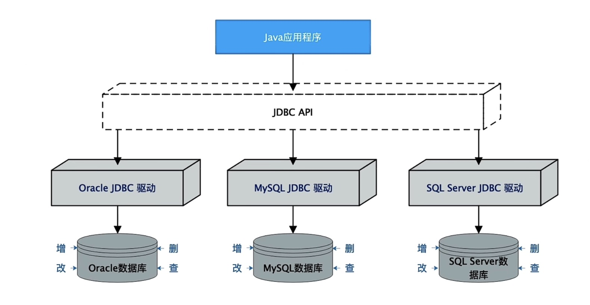

# Java Spi的原理和实践

## Java SPI的概念和术语
> SPI: 全称是 Service Provider Interface
>
> 它是从 java 6 开始引入的，是一种基于 ClassLoader 来发现并加载服务的机制。

一个标准的SPI，由三个组件构成，分别是：
- Service

  Service，是一个公开的接口或抽象类，定义了一个抽象的功能模块。

- Service Provider

  Service Provider，则是 Service 接口的一个实现类。

- ServiceLoader

  ServiceLoader，是SPI机制中的核心组件，负责在运行时发现并加载 Service Provider。

Java SPI 的运行流程：

## 思考
~~~markdown
思考：
1. SPI 的作用是什么？解决了什么问题？

2. 如果要实现一个 SPI 应用，需要怎么做?

3. 背后的设计思想是什么？我们能得到什么启示？
~~~

## Java SPI 在 JDBC 中的应用
> JDBC，全称是 Java DataBase Connectivity
- JDBC 即使用 Java 语言来访问数据库的一套 API
- 每个数据库厂商都会提供各自的 JDBC 实现

JDBC 架构图：

### SPI 之前 JDBC 访问数据库

应用程序
- Load Driver
- Open Connection
- Execute Statement
- Process ResultSet
- Close Connection
~~~java
// 1. 加载驱动(使用 Class.forName 
// JDBC 要求 Driver 实现类在类加载的时候，能将自身的实例对象自动注册到 DriverManager 中，从而加载数据库驱动
Class.forName("com.mysql.jdbc.Driver");
Class.forName("com.mysql.jdbc.OracleDriver");
Class.forName("com.microsoft.sqlserver.jdbc.SQLServerDriver");
// 2. 打开数据库连接
Connection conn = DriverManager.getConnection(url, user, password);
// 3. 执行SQL语句(使用 Statement 类)
Statement st = conn.createStatement();
ResultSet rs = st.executeQuery("SELECt * FROM table_user LIMIT 1");
// 4. 处理结果集(使用 ResultSet 类)
while (rs.next()) {
  System.out.println(rs.getInt("id));
}
// 5. 关闭连接
rs.close();
st.close();
conn.close();
~~~

### Java SPI 出现后 JDBC 访问数据库
~~~java
// 1. 引入数据库驱动的 JAR 包（例如 mysql-connector-java.<version>.jar）
// 2. 打开数据库连接
Connection conn = DriverManager.getConnection(url, user, passowrd);
// 3. 执行SQL语句(使用 Statement 类)
Statement st = conn.createStatement();
ResultSet rs = st.executeQuery("SELECt * FROM table_user LIMIT 1");
// 4. 处理结果集(使用 ResultSet 类)
while (rs.next()) {
  System.out.println(rs.getInt("id));
}
// 5. 关闭连接
rs.close();
st.close();
conn.close();
~~~

### Java SPI 的三大规范要素
#### 1. 规范的配置文件：
- 文件路径：必须在JAR包中的 META-INF/services 目录下
- 文件名称：Service 接口的全限定名
- 文件内容：Service 实现类（即Service Provider类）的全限定名。如果有多个实现类，那么每一个实现类在文件中单独占据一行

#### 2. Service Provider 类必须具备无参的默认构造方法：

- Service 接口的实现类，即 Service Provider 类，必须具备无参的默认构造方法。因为随后通过反射技术实例化它时，是不带参数的

#### 3. 保证能加载到配置文件和 Service Provider 类

- 方式一：将 Service Provider 的 JAR 包放到 classpath 中（最常用）
- 方式二：将 JAR 包安装到 JRE 的扩展目录中
- 方式三：自定义一个 ClassLoader

### 总结

#### 作用

提供了一种组建发现和注册的方式，可以用于实现各种插件，或者灵活替换框架所使用的组建

#### 优点

基于面向接口编程，优雅地实现模块之间的解耦

#### 设计思想

面向接口 + 配置文件 + 反射技术

#### 应用场景

JDBC SLF4J Servlet容器初始化 ...

### Java SPI 与 SpringBoot 自动配置

SpringBoot 自动配置，即大名鼎鼎的 Auto-Configuration:

- 它是指基于你引入的依赖 Jar 包，对 SpringBoot 应用进行自动配置
- 提供了自动配置功能的依赖 Jar 包，通常被称为 starter，例如 mybatis-spring-boot-starter 等等

#### Java SPI 的设计思想

1. 使用约定的配置文件
2. 谁提供 Jar 包，也负责提供配置文件
   - 高内聚低耦合，代码+配置一肩挑
3. 使用 ClassLoader 的 getResource 和 getResources 方法，来读取 classpath 中的配置文件

#### SpringBoot 自动配置的核心实现

1. 使用约定的配置文件：
   - 文件路径是：META-INF/spring.factories
   - 文件内容是"key=value1,value2,...valueN"的格式。其中 key 是 "EnableAutoConfiguration" 的类名，value 是自动配置的类名
2. 提供自动配置类的 Jar 包中，也同时提供配置文件 META-INF/spring.factories
3. 和 SPI 一样：使用 ClassLoader 的 getResource 和 getResources 方法，来读取 classpath 中的配置文件
