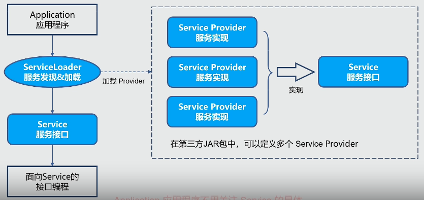

# Java Spi的原理和实践

## Java SPI的概念和术语
> SPI: 全称是 Service Provider Interface
>
> 它是从 java 6 开始引入的，是一种基于 ClassLoader 来发现并加载服务的机制。

一个标准的SPI，由三个组件构成，分别是：
- Service

  Service，是一个公开的接口或抽象类，定义了一个抽象的功能模块。

- Service Provider

  Service Provider，则是 Service 接口的一个实现类。

- ServiceLoader

  ServiceLoader，是SPI机制中的核心组件，负责在运行时发现并加载 Service Provider。

Java SPI 的运行流程：

## 思考
~~~markdown
思考：
1. SPI 的作用是什么？解决了什么问题？

2. 如果要实现一个 SPI 应用，需要怎么做?

3. 背后的设计思想是什么？我们能得到什么启示？
~~~

## Java SPI 在 JDBC 中的应用
> JDBC，全称是 Java DataBase Connectivity
- JDBC 即使用 Java 语言来访问数据库的一套 API
- 每个数据库厂商都会提供各自的 JDBC 实现
