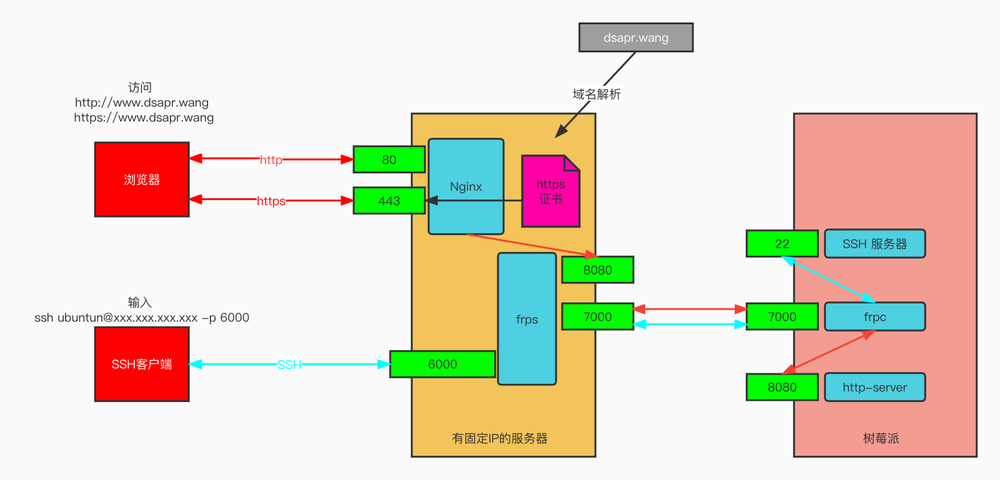

# 树莓派 frp 内网穿透
> 本次操作将通过 frp 内网穿透：
>
> 1. 提供一个域名，并可通过公网访问
> 2. 配置 ssh，可以通过公网进行 ssh 远程登录，端口6000
## 原理

浏览器对域名的默认请求指向80（http）和 443（https）端口，首先在服务端安装Nginx，占用 80 和 443 端口，用于接收 http 和 https 请求，然后写一套规则，针对 dsapr.wang 域名的请求，统一转发到 8080 端口。https 的规则部分给域名配置 https 证书（使用acme.sh设置nginx多个https证书自动更新，无限续期https证书），8080 端口被 frp 的服务端进程 fprs 占用，frps 将请求发送给树莓派的客户端 frpc，fprc 将来自 frps 的请求转发给树莓派运行在 8080 的 http-server 服务；SSH 转发规则与 HTTP 类似，从服务器的 6000 端口，转发到树莓派的 22 端口。

## 树莓派 Ubuntu Server 20.04 系统安装

## 客户端设置

## 服务端设置

首先开放服务端以下几个端口的安全策略：

1. 80（Nginx 接收 http 请求用）
2. 442 （Nginx 接收 https 请求用）
3. 6000 （转发映射 SSH 服务用）
4. 8080 （转发映射 http 服务用）

## 参考博客

> 参考博客
> 
> https://www.jianshu.com/p/a921e85280ed
> 
> https://mlapp.cn/348.html