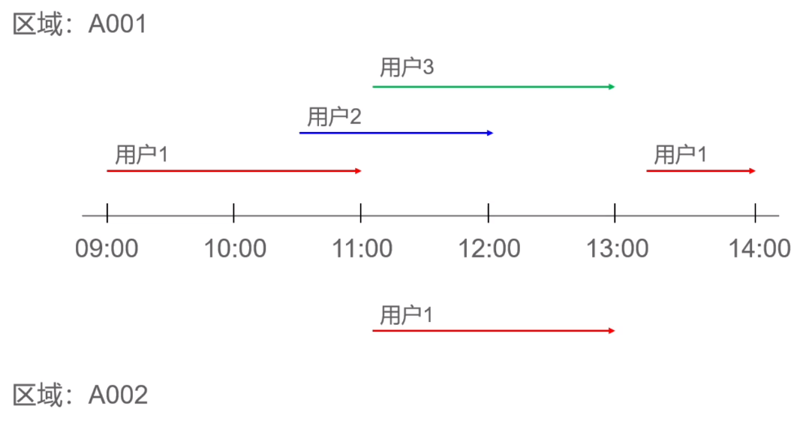

# SQL 编程思想

## 分页查询那些事

> 分页查询是指为了改善前端用户的体验和系统性能，将查询结果分批返回和展示。分页查询常用的两种方式：
>
> 1. OFFSET 分页。利用 SQL 标准 OFFSET FETCH 或者 LIMIT OFFSET 子句制定偏移量和返回的行数，性能随着偏移量的增加明显下降。
> 2. Keyset 分页，利用每次返回的记录集查找下一次的数据，性能不受数据量和偏移量的影响。可以实现页面无限滚动效果。

创建用户表

~~~mysql
CREATE TABLE users(
  id integer PRIMARY KEY,
  name varchar(50) NOT NULL,
  pswd varchar(50) NOT NULL,
  email varchar(50),
  create_time timestamp DEFAULT CURRENT_TIMESTAMP NOT NULL,
  notes varchar(200)
);
~~~

生成示例数据

~~~mysql
-- 生成示例数据
-- MySQL语法
INSERT INTO users(id, name, pswd, email,create_time)
WITH RECURSIVE t(id, name, pswd, email,create_time) AS (
SELECT 1, CAST(concat('user', 1) AS char(50)), 'e10adc3949ba59abbe56e057f20f883e', CAST(concat('user',1,'@test.com') AS char(50)), '2020-01-01 00:00:00'
UNION ALL
SELECT id+1, concat('user', id+1), pswd, concat('user',id+1,'@test.com'), create_time+ INTERVAL mod(id,2) MINUTE
FROM t WHERE id<1000000
)
SELECT /*+ SET_VAR(cte_max_recursion_depth = 1M) */* FROM t;
~~~
count 优化
~~~mysql
SELECT count(*)
FROM users;
-- 优化
1. 是否有必要返回所有count(*), 如果有必要，基于索引条件搜索
2. EXPLAIN 返回 rows 大概评估数量
~~~

### OFFSET 实现优化

~~~mysql
EXPLAIN
SELECT *
FROM users
WHERE create_time
ORDER BY create_time, id -- 1. 优化 创建create_time索引，id 自带索引
LIMIT 20 OFFSET 100000; -- OFFSET 数量过大时速度减慢

-- 缺点：依然扫描索引，摒弃LIMIT之前的数据，扫描数量过多还是扫描全表
CREATE INDEX idx_users_ct ON users(create_time);
~~~

### Keyset 方式优化

~~~mysql
SELECT *
FROM users
WHERE create_time >= '2020-01-01 00:10:00' AND id > 20
ORDER BY create_time, id
LIMIT 20;

-- create_time 有索引，根据上次查询结果直接找到某一行记录向后 LIMIT
-- 缺点：不能制定页码跳页
~~~

|    编程语言    |            Java            |       Javascript       |         Python          |     PHP      |
| :------------: | :------------------------: | :--------------------: | :---------------------: | :----------: |
| Keyset分页框架 | JOOQ Blaze-Persistence | Node.js Massive.js | SQL Alchemy  Django | Laravel 8.0+ |

## 员工考勤记录

> 公司规定周一到周五（节假日除外）每天早上九点上班，下午六点下班，上下班都需要打卡。日历信息存储calendar表中，员工的打卡记录存储在attendance表中：

|  id  | check_date | emp_id |      clock_in       |      clock_out      |
| :--: | :--------: | :----: | :-----------------: | :-----------------: |
|  1   | 2022-04-17 |   1    | 2022-04-17 08:34:02 | 2022-04-17 18:32:03 |
|  2   | 2022-04-17 |   2    | 2022-04-17 08:10:03 | 2022-04-17 19:31:02 |
|  3   | 2022-04-17 |   3    | 2022-04-17 08:55:08 | 2022-04-17 18:33:02 |
| ...  |    ...     |  ...   |         ...         |         ...         |

HR想要统计2022年4月份的员工缺勤记录，请问如何通过SQL查询相关记录？

~~~sql
SELECT c.calendar_date, e.emp_name, a.clock_in, a.clock_out,
			 CASE WHEN a.clock_out IS NULL "缺勤"
			 			WHEN EXTRACT(HOUR FROM a.clock_in) >= 9 THEN "迟到"
			 			ELSE "早退"
			 END AS "考勤状态"
FROM calendar c
CROSS JOIN employee e
LEFT JOIN attendance a
ON (a.check_date = c.calendara_date AND a.emp_id = e.emp_id)
WHERE c.calendar_year = 2021 AND c.calendar_month = 4 AND c.is_work_day = 'Y'
AND (a.id IS NULL
     OR a.clock_out IS NULL
     OR EXTRACT(HOUR FROM a.clock_in) >= 9
     OR EXTRACT(HOUR FROM a.clock_out) < 18);
~~~

# SQL 面试题

## 基于扫码记录 查找密接人员

|    uid    | area |      scan_time      |
| :-------: | :--: | :-----------------: |
| 130111111 | A001 | 2022-05-01 09:00:00 |
| 130111111 | A001 | 2022-05-01 10:00:00 |
| 130111111 | A001 | 2022-05-01 11:00:00 |
| 130222222 | A002 | 2022-05-01 11:05:00 |
|    ...    | ...  |         ...         |

### 问题一

- 找出每个用户在每个区域的行动轨迹

~~~mysql
WITH tmp AS (
SELECT uid, area, scan_time,
	   -- 扫描时间排序 - 区域划分后扫描时间排序
	   ROW_NUMBER() OVER (PARTITION BY scan_time) num1 - ROW_NUMBER() OVER (PARTITION BY scan_time, area ORDER BY scan_time) diff
FROM trail)
SELECT uid, area, min(scan_time) start_time, max(scan_time) end_time
FROM tmp 
GROUP BY uid, area, diff
ORDER BY uid, scan_time;
~~~

### 问题二

- 加入某个用户核酸检查为阳性，找出他的伴随人员

  伴随规则：在阳性人员停留半小时以上的区域，用户停留半小时以上，并且停留时间和阳性人员有十分钟以上的交集。

  

~~~mysql
WITH tmp AS (
SELECT uid, area, scan_time,
	   -- 扫描时间排序 - 区域划分后扫描时间排序
	   ROW_NUMBER() OVER (PARTITION BY scan_time) num1 - ROW_NUMBER() OVER (PARTITION BY scan_time, area ORDER BY scan_time) diff
FROM trail),
tmp2 AS (
SELECT uid, area, min(scan_time) start_time, max(scan_time) end_time
FROM tmp 
GROUP BY uid, area, diff
HAVING min(scan_time) + INTERVAL 30 MINUTE <= max(scan_time)
)
SELECT *
FROM tmp2 u1
JOIN tmp2 u2
ON (u1.uid <> u2.uid AND u1.area = u2.area
	AND u1.start_time + INTERVAL 10 MINUTE <= u2.end_time
	AND u2.start_time + INTERVAL 10 MINUTE <= u1.end_time)
WHERE u1.uid = "13011111111";
~~~

### 思考

- 算出和密接人员接触的时间
