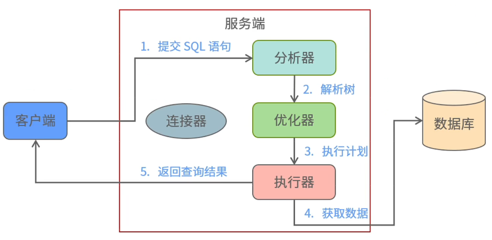

# 一条查询语句执行的过程

一条 SQL 语句从客户端发送请求开始，到服务器后经过服务器处理后进行查询后返回结果的生命周期过程

## 查询语句执行过程

中间部分代表数据库的一些内存或者后台的一些进程，通常叫做实例，右边代表真实的物理数据库，通常叫做物理存储。

首先，服务端的连接器（监听器）对客户端的请求经过一系列检查，合法后建立一个连接进程和客户端进行对接。

mysql 客户端建立连接实例：

~~~mysql
mysql -h 127.0.0.1 -P 3306 root test_db -p
~~~

